# La Canasta de Buena Vida — Sistema de Gestión de Almacén

Trabajo Final · Curso **Ingeniería de Software III** (USIL) 
Docente: Alfaro Gutiérrez, Gianny Romie

## 📋 Descripción general

Sistema de digitalización del área de almacén para una tienda de abarrotes tradicional de gestión familiar, que hasta el momento dependía de registros manuales para controlar inventario, proveedores y movimientos de stock. El sistema centraliza esa información en un panel de **Back-Office** administrativo (sin rol de cliente), construido en **PHP** con arquitectura **MVC** y base de datos **MySQL**.

**Problema que resuelve:** falta de datos en tiempo real para negociar con proveedores, identificar pérdidas por caducidad o tomar decisiones de compra basadas en algo más que intuición.

### Alcance
- Control total de inventario: registro, edición y eliminación de productos y categorías.
- Gestión de proveedores (base de datos de contactos comerciales).
- Monitoreo de movimientos: entradas (compras) y salidas (ventas/mermas).
- Tablero de reportes: productos con stock crítico y resumen de movimientos.
- Seguridad administrativa: acceso restringido por credenciales y roles.

## 🖼️ Capturas del sistema

**Inicio de sesión**

**Dashboard del administrador**
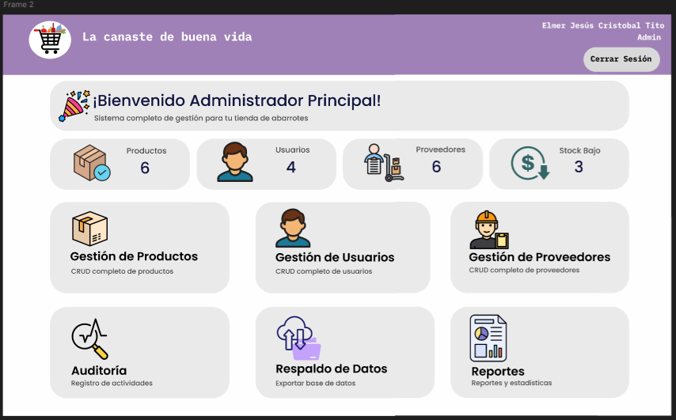

**Gestión de productos**

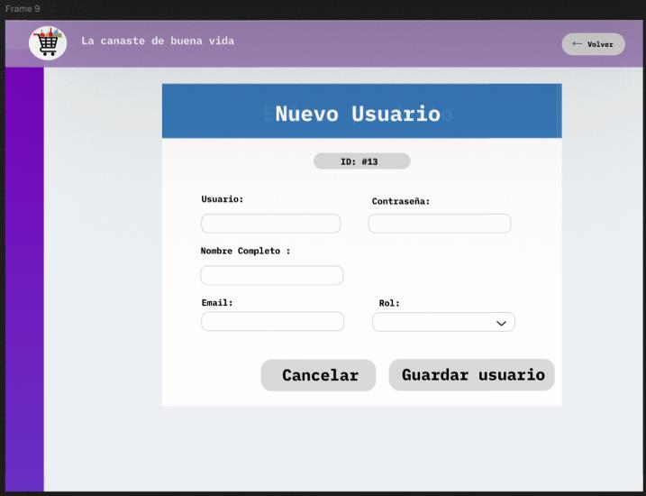

**Gestión de usuarios**
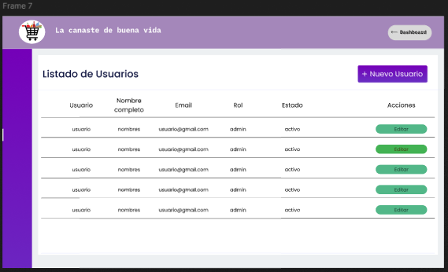
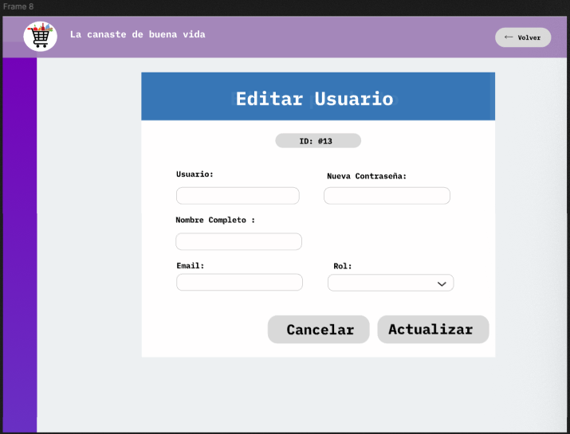

**Gestión de proveedores**
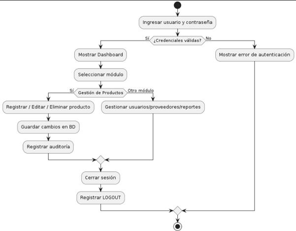

**Auditoría y respaldo**
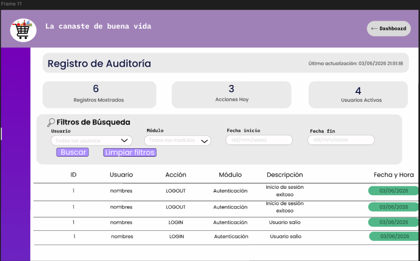
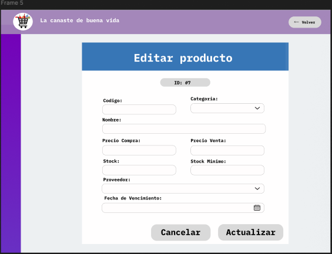

**Resumen general de inventario**
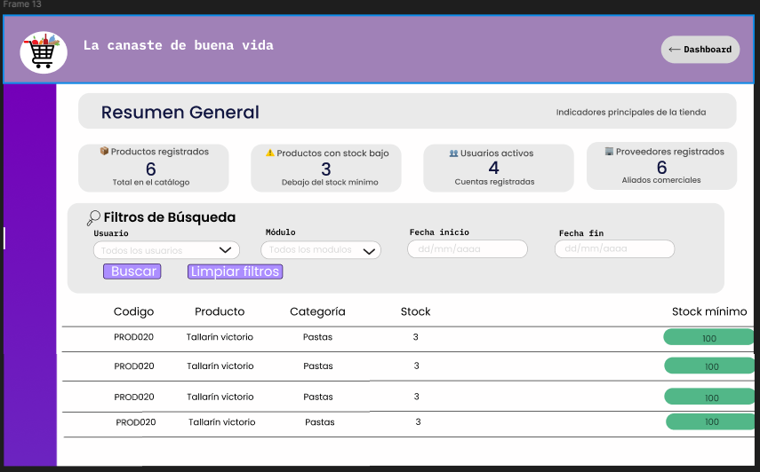

## 🏗️ Arquitectura y diseño

Diagrama de clases con las entidades del dominio (Usuario, Inventario, Ubicación, Recepción, Producto, Pedido):

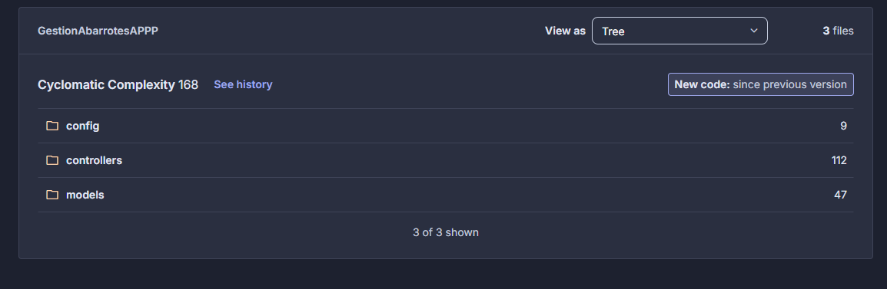

Flujo operativo principal (validación de credenciales → Dashboard → operaciones CRUD → auditoría):

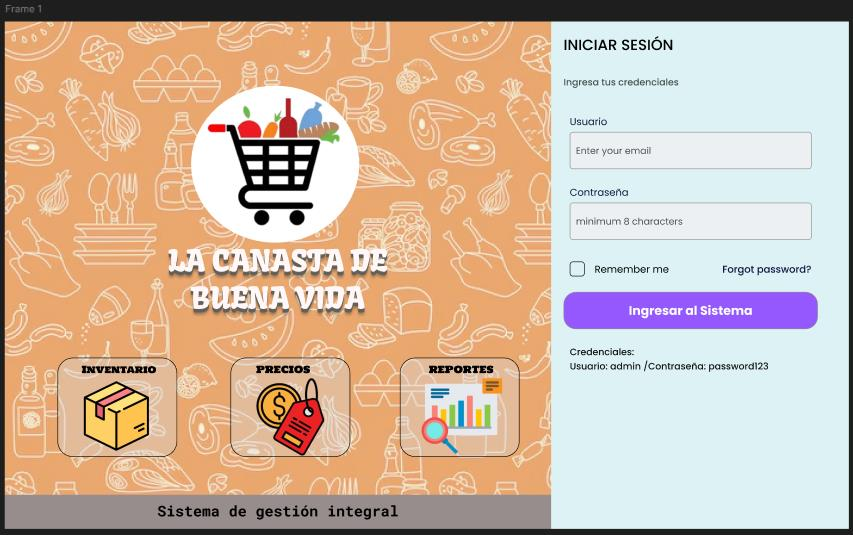

## 📐 Requisitos (SRS)

El sistema documenta **12 historias de usuario** y **53 criterios de aceptación**, distribuidos en 5 módulos:

| Módulo | Historias de usuario | Criterios de aceptación |
|---|---|---|
| Autenticación de Usuarios | 3 | 14 |
| Catálogos (Productos, Categorías, Proveedores) | 3 | 14 |
| Gestión de Inventario | 2 | 6 |
| Seguridad y Roles | 1 | 5 |
| Historial y Auditoría | 1 | 3 |

## 🧪 Evidencia de calidad — Certificación QA

El sistema fue sometido a un ciclo formal de aseguramiento de calidad ejecutado por un equipo evaluador externo (Grupo 2), bajo el marco **ISO/IEC 25010**. Como System Owner, se elaboró un informe de contraste entre lo especificado en el SRS y lo efectivamente certificado por el equipo tester.

**Resultados de la ejecución de pruebas** (30 de 90 casos planificados fueron seleccionados para automatización con PHPUnit sobre GitHub Actions):

| Resultado | N° de casos | % (sobre 30) |
|---|---|---|
| Aprobado | 15 | 50.0% |
| Fallido | 1 | 3.3% |
| Omitido | 14 | 46.7% |

- **Núcleo transaccional estable**: autenticación, catálogo de productos y gestión de proveedores mostraron una tasa de éxito del **93.75%** sobre los casos efectivamente ejecutados.
- El único caso fallido (eliminación de proveedor) resultó ser una discrepancia entre el caso de prueba y el criterio de aceptación real del SRS (el sistema hace eliminación lógica, no física, para preservar el historial — comportamiento correcto según el SRS).
- Los 14 casos omitidos correspondieron a funcionalidades de Categorías, Movimientos de Inventario y Auditoría aislada que no estaban disponibles en la versión de código evaluada — una brecha real de certificación documentada y con recomendación de una segunda ronda de pruebas.

**Análisis propio de calidad de código (SonarQube):**

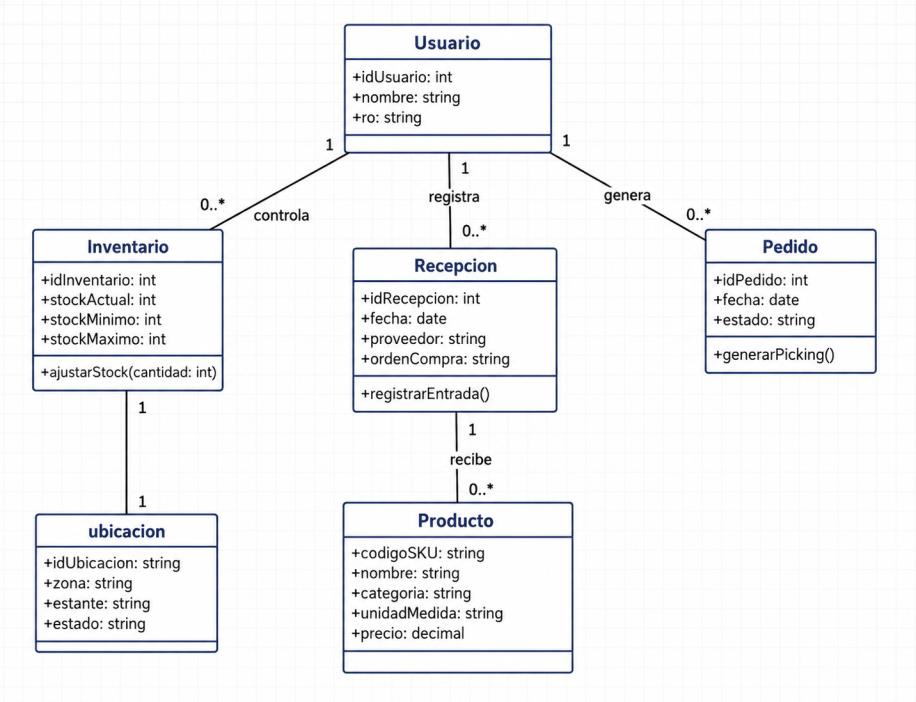

Quality Gate **Passed**, 0% de duplicación, 16.9% de cobertura de código sobre ~2000 líneas analizadas.

La complejidad ciclomática (168 total) se concentra en la capa de `controllers` (112), consistente con las limitaciones de testeo unitario reportadas en los controladores que dependen de variables globales de HTTP.

## 🛠️ Stack tecnológico

| Área | Tecnología |
|---|---|
| Backend | PHP (Arquitectura MVC) |
| Base de datos | MySQL |
| Testing | PHPUnit, Mockery, GitHub Actions (CI) |
| Análisis de calidad | SonarQube |
| Documentación | SRS, diagramas UML, reporte formal APA |

Link de la pagina:
https://tiendaabarrotes.page.gd/tiendaAbarrotes/index.php?i=1   

## 👤 Autora de este repositorio

**Ariana Maricielo Abregu Balvin** — System Owner
Curso de Ingeniería de Software III, USIL
